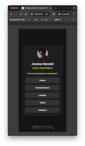
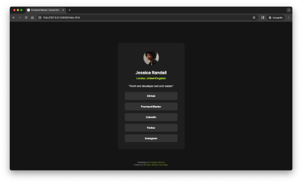

# Frontend Mentor - Social links profile

# Frontend Mentor - Social links profile solution

This is a solution to the [Social links profile challenge on Frontend Mentor](https://www.frontendmentor.io/challenges/social-links-profile-UG32l9m6dQ). Frontend Mentor challenges help you improve your coding skills by building realistic projects. 

## Table of contents

- [Overview](#overview)
  - [The challenge](#the-challenge)
  - [Screenshot](#screenshot)
  - [Links](#links)
- [My process](#my-process)
  - [Built with](#built-with)
  - [Useful resources](#useful-resources)
- [Author](#author)
- [Acknowledgments](#acknowledgments)

## Overview

### The challenge

Users should be able to:

- See hover and focus states for all interactive elements on the page
- Resize the viewport/window and see how the social-card adapts to:
  - Desktop screens
  - Mobile devices

### Screenshot

### Links

- Repository URL: [github.com/ironest/social-links-profile](https://github.com/ironest/social-links-profile)
- Live Demo URL: [social-links-profile-blue.vercel.app](https://social-links-profile-blue.vercel.app/)

## My process

### Built with

- Semantic HTML5 markup
- CSS custom properties
- Flexbox
- Mobile-first workflow
- Media Queries

### Useful resources

- [Google Fonts](https://fonts.google.com/) - Google Fonts provides an API to get the desired fonts to your web pages.
- [Photopea](https://www.photopea.com/) - This is a web-based photo and graphics editor. It is used for image editing, making illustrations, web design. I've used it to derive color/sizes/spacing from the provided designs

## Author

- Linkedin - [@carzanigariccardo](https://www.linkedin.com/in/carzanigariccardo/)
- Github - [@ironest](https://www.github.com/ironest)
- Instagram - [@ironest](https://www.instagram.com/ironest)

## Acknowledgments

C.I.T.E. (Code In the Evening) a new group of emerging developers consisting of myself, [Fischer](https://github.com/jfcode101/jfcode101), [Liz](https://github.com/martinsliz) and [Javier](https://www.linkedin.com/in/javier-liz-0955ba24/).
Thank you guys for introducing me to the fantastic platform [Frontend Mentor](https://www.frontendmentor.io) and for the motivation you provide each other.